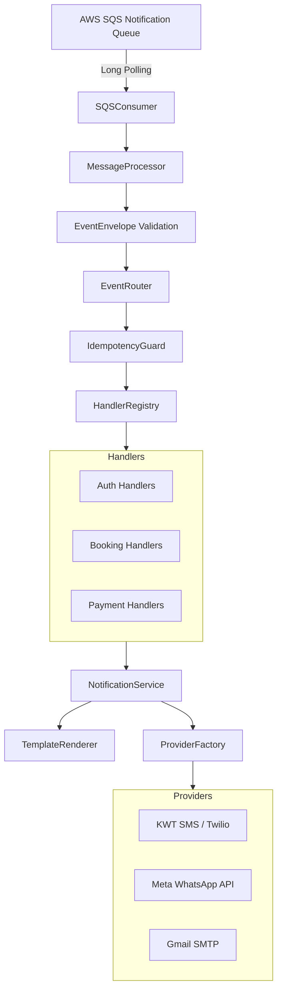

# `ushnotice` Architecture & Design Specification

## 1. System Philosophy
`ushnotice` is designed under Clean Architecture and Event-Driven Architecture principles:
- **Core Domain Independence**: Notifications, Recipients, and Delivery Results are pure domain value objects and models independent of delivery mechanisms.
- **Provider Protocol Abstraction**: All notification providers (SMS, WhatsApp, Email) implement strict typing Protocols. Concrete integrations (`KwtSmsProvider`, `MetaWhatsAppProvider`, `GmailProvider`) can be swapped or extended without modifying core routing logic.
- **Open/Closed Event Pipeline**: Event types and their corresponding handlers are dynamically registered with the `HandlerRegistry`. New events can be processed without altering the SQS consumer or router loop.
- **Strict Idempotency**: Each message is uniquely tracked via `(event_id, handler_name)` in PostgreSQL, preventing duplicate sends on message re-deliveries.

---

## 2. Component Diagram

---

## 3. Database Schema

- `events`: Persistent record of all received SQS messages.
- `event_processings`: Tracks handler execution state and enforces idempotency constraint `(event_id, handler_name)`.
- `notifications`: Top-level record per channel per event.
- `notification_status_history`: Immutable state transition audit trail.
- `notification_attempts`: Detailed log of every provider call (latency, status, raw response).
- `api_requests`: Audit trail of inter-service calls made to other USHSPA microservices.
